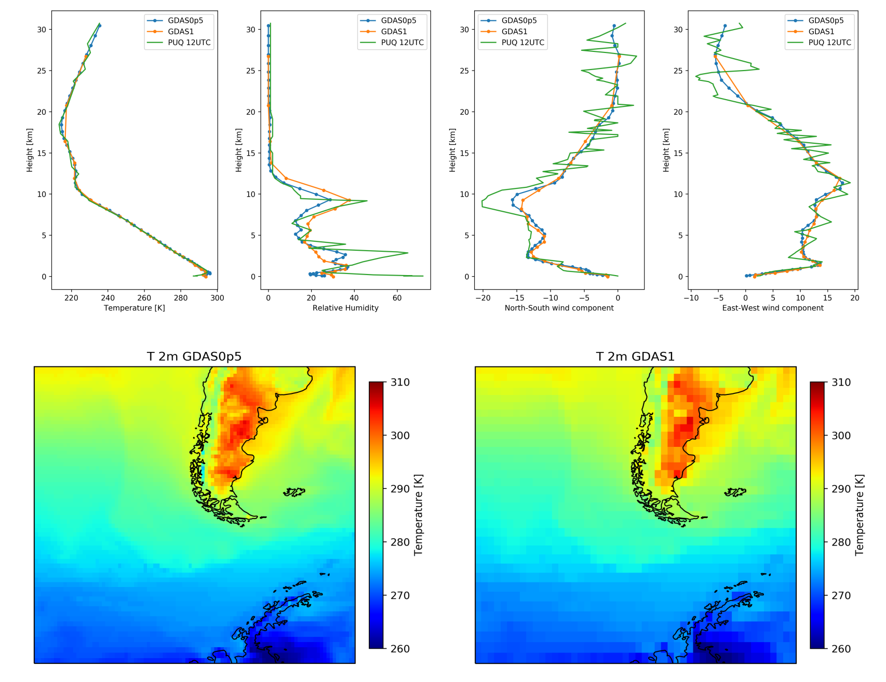

# ARLreader

Python only library to read the NOAA ARLs packed format for HYSPLIT (<https://ready.arl.noaa.gov/HYSPLIT.php>).
Currently only wokring for the GDAS1 assimilation data (<https://www.ready.noaa.gov/gdas1.php>), which is also available from ARL (<ftp://arlftp.arlhq.noaa.gov/pub/archives/gdas1>).
A more extensive description of the format is provided in: [Things to know when working with the ARL binary fomat](working_with_ARLformat.md)

Currently only GDAS1 and the profiles of GDAS0p5 are working.


### Usage

Reading a 2d Field:
```python
import ARLreader as Ar

gdas = Ar.reader('data/gdas1.apr14.w1')
print('indexinfo ', gdas.indexinfo)
print('headerinfo ', gdas.headerinfo)
for i, v in gdas.levels.items():
    print(i, ' level ', v['level'], list(map(lambda x: x[0], v['vars'])))
# load_heightlevel(day, houer, level, variable)
recinfo, grid, data = gdas.load_heightlevel(2, 3, 0, 'RH2M')
```

Read the profile at a given location an write it to a text file with `load_profile(day, hour, (lat, lon))`:
```python
profile, sfcdata, indexinfo, ind = Ar.reader('data/gdas1.apr14.w1').load_profile(2, 3, (51.3, 12.4))
print(profile)
Ar.write_profile('testfile.txt', indexinfo, ind, (51.3, 12.4), profile, sfcdata)
```

Get the filename from a datetime `Ar.fname_from_date(datetime.datetime(2014, 4, 3))`.





### Installation 
```
git clone https://github.com/martin-181/ARLreader.git
cd ARLreader
python3 example.py
```

### Tests
`python3 -m pytest -v`

### License
The code is partly based on a prior implementation in IDL by Patric Seifert.

Copyright 2017, Martin Radenz 
[MIT License](http://www.opensource.org/licenses/mit-license.php)
